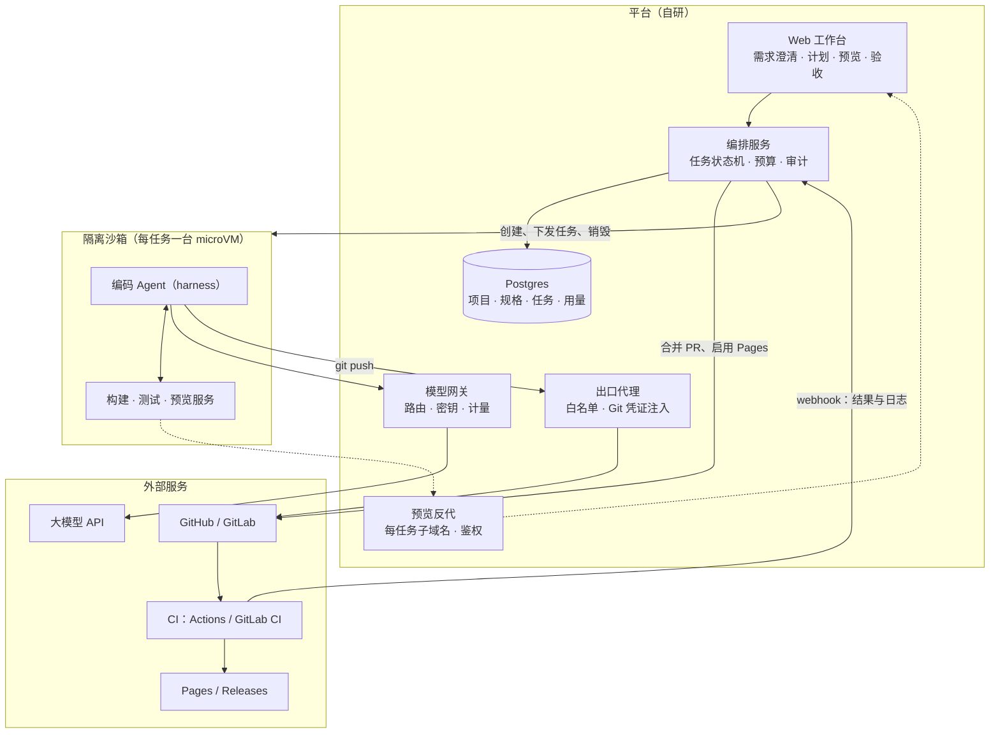
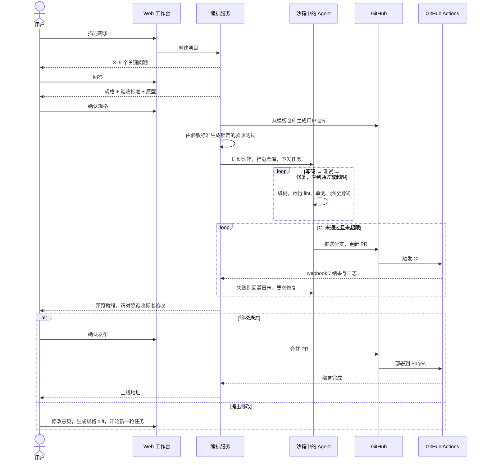
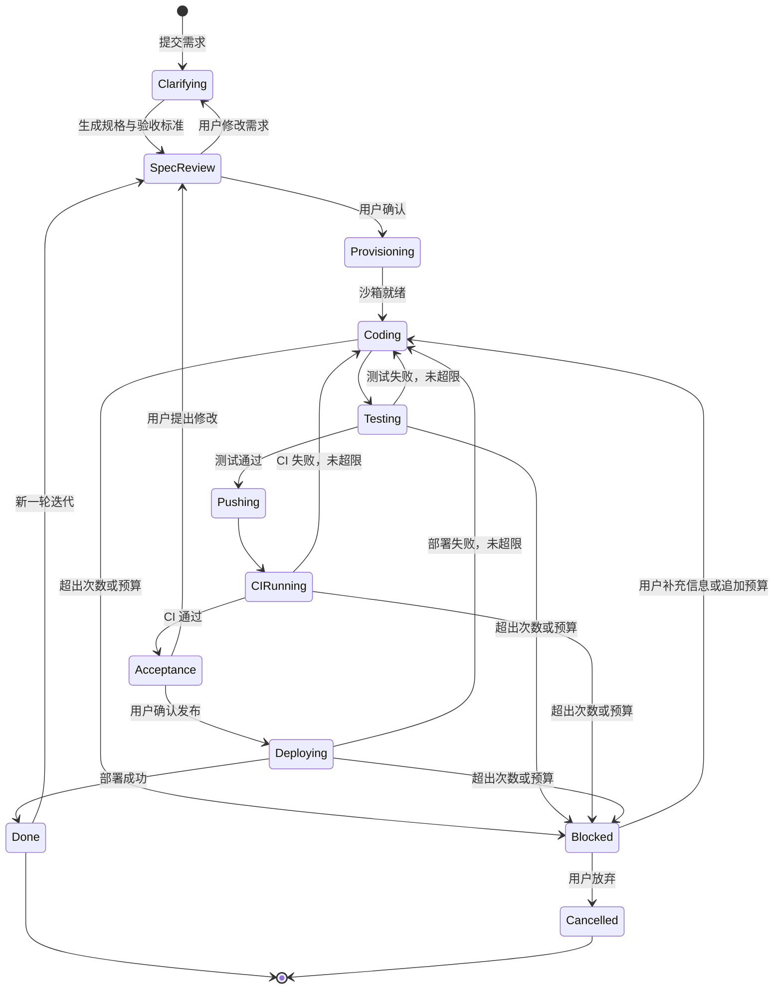
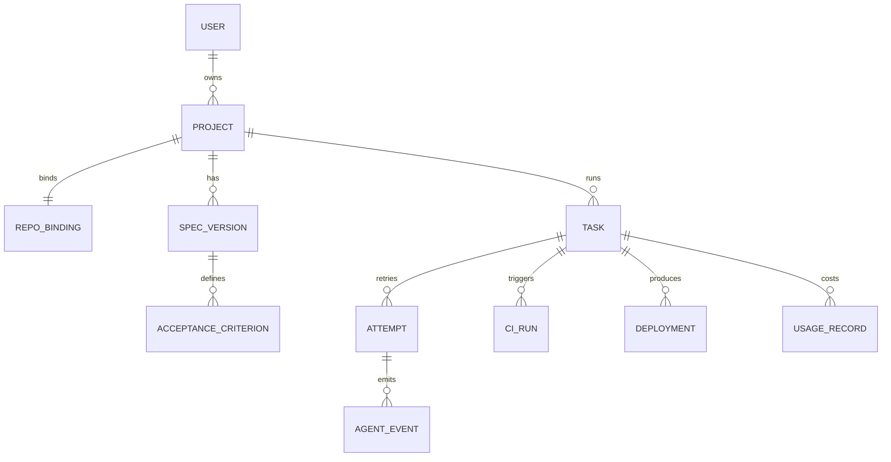

# 技术方案

> 状态：草案 v0.1（2026-09-17）。选型都是建议，未拍板的事项见[决策记录](05-decisions.md)。

## 1. 设计原则

1. **收窄技术栈，只做黄金路径。** 每类项目只支持一套模板，模板里固定目录结构、测试框架、CI 和 agent 规范。
2. **先规格后编码。** 验收标准在编码前由用户确认并锁定，编码 agent 无权修改。
3. **Git 是唯一事实源。** 沙箱无状态、用完即弃；每一步一个 commit，随时可以回滚。
4. **闭环必须有上限。** 每一层重试都有次数和预算上限，超了就停下来求助。
5. **不自研 agent loop。** 用成熟的 harness，把精力放在需求、模板、验证、发布和计费上。
6. **凭证不进沙箱。** 所有外部凭证在代理层注入，沙箱和模型上下文里都看不到。

## 2. 总体架构



三层闭环：
1. **沙箱内**：写码 → 测试 → 修复，直到验收测试通过。
2. **CI**：CI 失败时，编排服务把日志回灌给 agent，修复后重新推送。
3. **用户**：用户在预览环境验收，不满意就提修改，进入下一轮。

## 3. 核心流程



## 4. 任务状态机



| 状态 | 含义 |
|---|---|
| Clarifying | 澄清 agent 提问，收集需求 |
| SpecReview | 等待用户确认规格、验收标准、原型 |
| Provisioning | 生成或更新仓库，生成验收测试，启动沙箱 |
| Coding / Testing | 沙箱内的写码与测试循环 |
| Pushing / CIRunning | 推送分支，等待 CI 结果 |
| Acceptance | 等待用户在预览环境验收 |
| Deploying | 合并 PR，等待 Pages 部署完成 |
| Blocked | 触达上限，等待用户处理；必须给出看得懂的原因和建议操作 |
| Done / Cancelled | 终态；Done 之后可以开启新一轮迭代 |

上限建议初值（Phase 0 用评测数据校准）：

| 上限 | 建议初值 |
|---|---|
| 沙箱内"写码-测试"迭代 | 8 次 |
| CI 失败自动修复 | 3 次 |
| 部署失败自动修复 | 2 次 |
| 单任务 token 预算 | 首版 $15，单次修改 $3 |
| 单任务总耗时 | 60 分钟 |
| 沙箱空闲回收 | 15 分钟 |

## 5. 组件设计与选型

### 5.1 Web 工作台

- Next.js + React + TypeScript + Tailwind。
- 用 SSE 推送任务事件：计划、步骤、日志、diff、成本、状态变化。
- 预览用 iframe 嵌入预览 URL；diff 用只读的代码对比组件展示。
- 模型输出一律按不可信内容渲染，做转义和净化，防 XSS。

### 5.2 编排服务

- Go 或 TypeScript。
- 用 Temporal 做持久化工作流：每个任务一个 workflow，每个步骤一个 activity；用户确认、验收这类人工操作用 signal。重试、超时、崩溃恢复都由 Temporal 负责。
- Postgres 存业务数据；任务事件落库，可以回放；实时推送用 Redis Streams 或 NATS 分发。
- 负责所有有副作用的外部操作：创建仓库、合并 PR、启用 Pages。agent 只能推分支。

### 5.3 Agent 运行时

三个方案，最终选择见[决策记录](05-decisions.md) Q-04。

| 方案 | 形态 | 优点 | 缺点 | 适用 |
|---|---|---|---|---|
| A. Claude Agent SDK | Claude Code 的 harness 做成库，跑在自己的沙箱里 | 文件编辑、命令执行、上下文管理、子 agent、hooks 都很成熟；沙箱完全自控 | 绑定 Claude 模型；沙箱和凭证代理要自建 | 海外，以 Claude 为主力模型 |
| B. Anthropic Managed Agents（beta） | Anthropic 托管 agent loop 和每会话容器 | 最省事：容器、GitHub 仓库挂载（token 经 Anthropic 侧 git 代理注入，不进容器）、出网白名单、会话级美元预算、outcome 评分循环、webhook 都是现成的；工具执行也可以放在自有机房 | beta；强绑定单一厂商；创建 PR 需另接 GitHub MCP 或由编排服务调 API | 海外，想最快验证 MVP |
| C. 开源 harness | OpenHands、OpenCode、Codex CLI、Qwen Code 等 | 模型可换（含国产模型）；能私有化；代码可改 | 质量参差，要自己调优和维护 | 国内、私有化、多模型 |

无论选哪个方案，编排服务和 agent 之间都通过一层内部**任务协议**对接，便于以后替换：

| 方向 | 内容 |
|---|---|
| 输入 | 任务 ID、仓库与分支、目标、规格版本、验收标准、约束（预算、迭代上限、允许的命令）、模板里的 AGENTS.md |
| 输出事件 | plan、step_started、tool_call、command_output、file_diff、test_result、cost_update、blocked（原因）、completed（摘要与 commit 列表） |
| 控制 | pause、resume、inject_message、cancel |

### 5.4 模型网关

- 统一调用入口（LiteLLM 或自研）：供应商路由、API key 管理（只存在网关里）、限流、重试、按任务计量、缓存命中率监控。
- 模型分层：规划和疑难修复用强模型；简单改动和日志摘要用便宜模型。评审 agent 可以用和编码 agent 不同的模型，减少同源偏差。
- 选方案 B 时由厂商侧调用模型，网关只负责计量对账。

### 5.5 沙箱

要求：
- microVM 或 gVisor 级隔离；每个任务独立沙箱；以非 root 用户运行。
- 预热池加快照：就绪 P95 ≤ 5 秒。
- CPU、内存、磁盘、时长都有配额；空闲回收。
- 默认禁止出网，只经出口代理访问白名单。
- 无持久状态，代码以 Git 为准。
- 基础镜像按模板预构建：Node LTS、pnpm、Playwright 与浏览器、git；依赖走镜像缓存。

| 方案 | 隔离 | 特点 |
|---|---|---|
| E2B | Firecracker microVM | AI agent 场景常用，隔离强 |
| Modal Sandboxes | gVisor | 运行时动态定义镜像，GPU 资源丰富 |
| Daytona | 容器（共享内核） | 预热池和快照使启动极快，开源可自托管；多租户下要评估隔离强度 |
| Vercel / Cloudflare Sandbox | 各自平台 | 和对应平台的部署链路结合紧密 |
| 自建 | Firecracker / Kata Containers / gVisor | 可控、可私有化，运维成本高 |
| 国内 | 云厂商托管沙箱，或在裸金属上自建 | 要评估隔离级别与合规 |

### 5.6 出口代理与凭证

- 沙箱的所有出网流量都经过出口代理：白名单放行包管理镜像、模型网关、Git 代理；拒绝私有网段和 `169.254.169.254`。
- **Git 代理**：沙箱向代理地址执行 `git push`，代理注入该仓库专用的 GitHub App 安装 token。token 不进沙箱，也不进模型上下文。
- 推送用 token 按需降权：只带 Contents 写权限，**不带 Workflows 权限**。agent 如果修改 `.github/workflows/`，推送会被 GitHub 直接拒绝。
- 用户应用自己的密钥（如第三方 API key）不在 MVP 范围内。以后存入密钥库，在 CI 里以 Actions secrets 的形式使用，不进沙箱。

### 5.7 预览服务

- 沙箱里启动预览服务，平台反代分配 `<任务 ID>.<预览域名>`。
- 预览链接需要登录态或签名，并设过期时间。
- 预览域名用独立注册的域名，和主站隔离，防止 cookie 泄露，也防止被拿去做钓鱼。

### 5.8 Git 集成

**GitHub（MVP）**：用 GitHub App，不用个人 token。

| 权限 | 级别 | 用途 |
|---|---|---|
| Metadata | Read | 必需 |
| Contents | Read & write | 推送代码、合并 |
| Pull requests | Read & write | 创建、合并 PR |
| Actions | Read | 读取 CI 结果和日志 |
| Pages | Read & write | 启用和配置 Pages |
| Workflows | Read & write | 只在平台更新 CI 模板时使用；agent 推送用的 token 不带此权限 |
| Administration | Read & write | 创建仓库 |

- 创建仓库：从平台的模板仓库生成用户仓库（generate from template）。要用用户授权的 token；如果 App 只安装在"选定的仓库"上，新仓库需要加入安装范围。具体行为在 Phase 0 验证。
- 订阅 webhook：`workflow_run`、`deployment_status`、`pull_request`、`installation`。
- 启用 Pages：编排服务调用 Pages API，构建方式选 GitHub Actions。

**GitLab（P1）**：OAuth 应用或 Project Access Token；`.gitlab-ci.yml`；GitLab Pages；订阅 Pipeline 和 Job 事件。

### 5.9 模板与命令契约

模板仓库结构（前端单页应用 → Pages）：

```text
template-spa-pages/
├── AGENTS.md              # 给 agent 的规范：技术栈、目录约定、命令、禁止事项
├── Makefile               # 统一命令契约
├── package.json
├── src/
├── tests/
│   ├── unit/              # 编码 agent 可写
│   └── acceptance/        # 由验收标准生成，锁定，编码 agent 只读
├── .github/workflows/
│   ├── ci.yml             # PR 触发：lint、类型检查、单测、验收测试、构建
│   └── pages.yml          # main 触发：构建并部署到 Pages
└── .cloudide/
    └── template.json      # 模板元数据：类型、预览端口、产物目录、发布目标
```

统一命令契约让编排服务不必关心具体技术栈：

| 命令 | 作用 |
|---|---|
| `make setup` | 安装依赖 |
| `make lint` | lint 和类型检查 |
| `make test` | 单元测试 |
| `make acceptance` | 验收测试（Playwright） |
| `make build` | 生产构建，产物输出到 `dist/` |
| `make preview` | 在固定端口启动预览 |

Pages 工作流要点：
- 流程：checkout → `make setup` → `make build` → `actions/upload-pages-artifact` 上传 `dist/` → `actions/deploy-pages` 部署。action 版本以实现时的最新版为准。
- 项目站点地址是 `https://<用户>.github.io/<仓库>/`，Vite 的 `base` 要设成 `/<仓库>/`。
- Pages 没有服务端路由回退，单页应用要用 hash 路由，或者把 `index.html` 复制一份为 `404.html`。

Release 模板（P1）：推送 tag 触发，在 Linux、macOS、Windows 上 matrix 构建，产物上传到 GitHub Release。

### 5.10 验证体系

| 层 | 内容 | 执行者 | 编码 agent 能否修改 |
|---|---|---|---|
| L1 静态检查 | lint、类型检查、构建 | 沙箱 + CI | 不涉及 |
| L2 单元测试 | 编码 agent 编写 | 沙箱 + CI | 可以 |
| L3 验收测试 | 由锁定的验收标准生成的 Playwright 测试 | 独立测试 agent 生成，沙箱 + CI 运行 | 不可以：只读挂载，编排服务在合并前检查 PR diff，改动该目录就拒绝 |
| L4 视觉检查 | 关键页面截图，多模态模型对照验收标准打分 | 独立评审 agent | 不涉及 |
| L5 代码评审 | 正确性、安全、可维护性 | 独立评审 agent（可用不同模型） | 不涉及 |
| L6 安全扫描 | gitleaks、osv-scanner、Semgrep | CI | 不涉及 |
| L7 用户验收 | 在预览环境逐条确认验收标准 | 用户 | 不涉及 |

MVP 做 L1、L2、L3、L7；L4、L5、L6 放到第二阶段。

### 5.11 计量、观测与评测

- 每次模型调用记录：任务 ID、模型、输入、缓存读取、缓存写入、输出 token 数、折算成本。另外记录沙箱时长和 CI 分钟数。
- 链路追踪用 OpenTelemetry，LLM 轨迹用 Langfuse。
- **评测集是核心资产**：收集黄金路径的真实需求样本（起步 30 条），每次改 prompt、模型、模板或 harness 都回归一遍，记录成功率、成本、耗时和失败原因。

## 6. 数据模型



| 实体 | 说明 |
|---|---|
| Project | 项目：名称、模板类型、所属用户、状态 |
| RepoBinding | 绑定的 Git 平台、仓库、GitHub App 安装 ID |
| SpecVersion | 规格版本：需求原文、澄清问答、规格正文、状态（草稿、已确认） |
| AcceptanceCriterion | 验收标准条目，关联生成的验收测试 |
| Task | 一次开发任务（首版或一次修改），对应一个 Temporal workflow |
| Attempt | 任务里的一次执行尝试；换模型、回滚重试都算新尝试 |
| AgentEvent | agent 事件流，用于实时展示和回放 |
| CIRun / Deployment | CI 运行和部署记录：状态、日志摘要、URL |
| UsageRecord | token、沙箱时长、CI 分钟数和折算成本 |

## 7. 安全设计

| 威胁 | 对策 |
|---|---|
| 沙箱逃逸、横向移动 | microVM 或 gVisor；每任务独立沙箱；非 root；资源配额；用完即销毁 |
| 滥用算力（挖矿等） | 出网白名单；CPU 和时长配额；异常行为检测 |
| 访问内网或云元数据 | 出口代理拒绝私有网段和 `169.254.169.254` |
| 凭证泄露 | token 只在代理层注入；GitHub App 短时 token、最小权限、限定到单个仓库；模型上下文里不出现密钥 |
| 提示词注入（来自依赖包、网页、issue、用户输入） | agent 不持有高危凭证；推送 token 不带 Workflows 权限；修改锁定测试的 PR 会被拒绝；合并和发布由编排服务在用户确认后执行 |
| 依赖投毒、幻觉包名（slopsquatting） | 经镜像代理安装并做信誉检查；新增依赖由评审 agent 审查；提交锁文件 |
| 生成代码有漏洞 | 模板默认安全配置；安全扫描；评审 agent |
| 破坏性操作 | agent 不持有生产凭证；只能推分支；main 设为受保护分支 |
| 平台被拿去做钓鱼、诈骗 | 发布到用户自己的账号；内容风险检测；预览域名与主站隔离；举报和封禁机制 |
| 预览链接被滥用 | 预览需要鉴权，并设过期时间 |
| 渲染模型输出导致 XSS | 前端对模型输出做转义和净化 |

## 8. 部署形态

| 形态 | 模型 | 沙箱 | Git 平台 | 发布目标 |
|---|---|---|---|---|
| 海外 SaaS | Claude 等前沿模型 | 托管沙箱（E2B、Modal 等）或 Managed Agents | GitHub | GitHub Pages、Vercel、Cloudflare |
| 国内 SaaS | 已备案的国产模型 | 国内云托管沙箱或自建 | 极狐 GitLab、Gitee 等（GitHub 访问不稳定） | 国内云静态托管，自定义域名要 ICP 备案 |
| 企业私有化 | 企业自选（国产模型或私有部署模型） | 企业内自建（Kata、gVisor） | 企业自有 GitLab | 企业内部环境 |

面向国内的额外约束：Anthropic 从 2025 年 9 月起不再向中国资本控股的企业提供服务，OpenAI API 不对中国大陆开放；面向公众的生成式 AI 服务要备案或登记；GitHub、npm、PyPI、Docker Hub 需要镜像和缓存。

## 9. 技术栈汇总

| 领域 | 建议 |
|---|---|
| 前端 | Next.js、React、TypeScript、Tailwind |
| 后端 | Go 或 TypeScript（Node） |
| 工作流 | Temporal |
| 数据 | Postgres、Redis Streams 或 NATS、对象存储（日志、截图） |
| Agent 运行时 | 见 5.3 |
| 模型网关 | LiteLLM 或自研 |
| 沙箱 | 见 5.5 |
| 模板内测试 | Vitest、Playwright |
| 安全扫描 | gitleaks、osv-scanner、Semgrep |
| 观测 | OpenTelemetry、Langfuse |
| 平台部署 | Kubernetes；沙箱层独立部署 |
